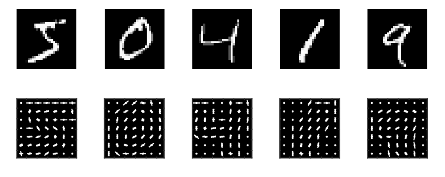
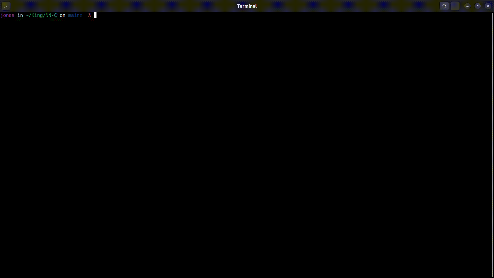

# perCeptron

**Implementation of a neural network (perceptron) in C to recognize handwritten digits using the MNIST dataset.**. The perceptron is a single-layer artificial neural network used for supervised binary classification. The perceptron uses a matrix to represent the neural networks and is a tertiary discriminator that maps its input (a binary vector) to a single output value (a single binary value) through this matrix. The simple perceptron is a classification model consisting of a hyperplane that separates the space into two regions and assigns a class to each of them. Regarding the dot product operation, the perceptron uses the dot product to calculate the weighted sum of the inputs and synaptic weights.



_MNIST Database_


## Compilation

First, you must train the neural network with the MNIST dataset. To do this, [download it from Kaggle](https://www.kaggle.com/datasets/oddrationale/mnist-in-csv?resource=download), unzip it, and save the `mnist_train.csv` and `mnist_test.csv` files in the data folder of the project.

### Training

Before running the prediction, you must train it with the MNIST dataset. To do this, ensure that in the `main.c` program, the prediction section is commented out and the training section is uncommented. This section should look like the following:

```c
// TRAINING
int number_imgs = 10000;
Img** imgs = csv_to_imgs("data/mnist_train.csv", number_imgs);
NeuralNetwork* net = network_create(784, 300, 10, 0.1);
network_train_batch_imgs(net, imgs, number_imgs);
network_save(net, "test");
```
To train the neural network, run the following command:

```bash
make
```



_Training the neural network_


### Prediction

Once the training is complete, you can run the prediction. To do this, comment out the training section and uncomment the prediction section. This section should look like the following:

```c
// PREDICTION
int number_imgs = 3000;
Img** imgs = csv_to_imgs("data/mnist_train.csv", number_imgs);
NeuralNetwork* net = network_load("test");
double score = network_predict_imgs(net, imgs, 1000);
printf("Score: %1.5f \n", score);
```

To run the program, execute the following command:

```bash
make
```


_Prediction of the neural network_

## Summary

This project implements a simple perceptron, a basic neural network model, for supervised binary classification of handwritten digits from the MNIST dataset. The perceptron uses a matrix-based approach to map input data (784-pixel images) to output classes (digits 0–9) through a dot product operation, leveraging a hyperplane to separate data into two regions. The implementation includes two main phases:

1. **Training Phase**: The perceptron is trained using the MNIST dataset, where it learns to classify images of handwritten digits by adjusting its weights based on the training data.
2. **Prediction Phase**: After training, the perceptron can predict the class of new images by loading the trained model and applying it to unseen data, providing a score that indicates the model's confidence in its predictions.

### Strengths and Limitations

- **Strengths**:
  - **Simplicity**: The use of a simple perceptron makes the project accessible for learning purposes, demonstrating fundamental neural network concepts like weighted sums and hyperplane-based classification.
  - **Practicality**: The inclusion of the MNIST dataset, a standard benchmark for digit recognition, ensures the project is relevant and replicable.

- **Limitations**:
    - **Model Simplicity**: A single-layer perceptron is limited in its ability to handle complex patterns due to its linear separability constraint. For MNIST, a multi-layer neural network or more advanced model (e.g., CNN) would likely yield better accuracy.
    - **Dataset Scope**: The README specifies using only 10,000 images for training and 3,000 for testing, which is a subset of the full MNIST dataset (60,000 training, 10,000 testing). This may limit model performance.
    - **Performance**: The model's performance is not evaluated in terms of accuracy or loss metrics, which are crucial for understanding its effectiveness. Including these metrics would provide a clearer picture of the model's capabilities.

This project serves as an educational tool for understanding basic neural network concepts and implementing a perceptron in C. It effectively demonstrates the workflow of training and predicting with the MNIST dataset. However, its reliance on a simple perceptron limits its practical performance compared to modern deep learning models.


